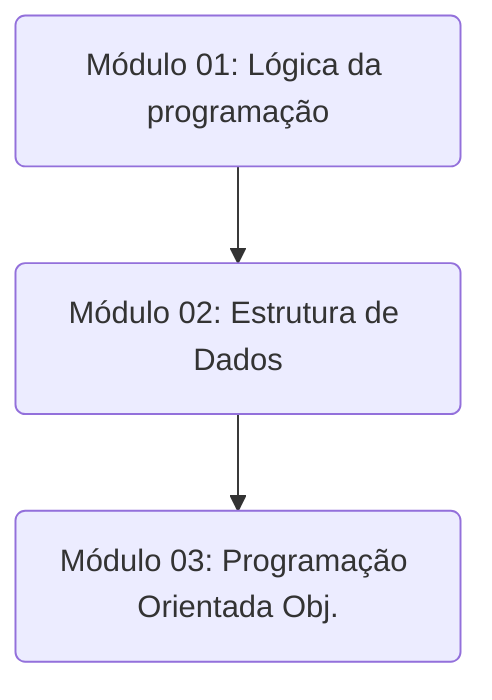

# Emprega Tech TODXS
Repositório para divulgar todos os projetos dentro da trilha de Formação Base de Desenvolvimento de Software da Emprega Tech da TODXS. Que é composto pelos seguintes módulos:

# Módulo 1

Dentro do módulo 1, foi aprendido os seguintes topicos:

1. Unidade – Fundamentos lógicos e algorítmicos.

2. Unidade – Paradigmas, linguagens, estruturas e ferramentas.

3. Unidade – Configuração, variáveis, operações e estruturas de controle básicas.

4. Unidade – Listas, tuplas, dicionários, matrizes e funções com recursividade.

### Projeto Final do módulo 1: Gerenciador de Tarefas em Python 

Este projeto consiste em um programa em Python que permite ao usuário gerenciar uma lista de tarefas. Ele inclui as seguintes funcionalidades:

- **Adicionar Tarefa:** O usuário pode adicionar uma nova tarefa à lista.
- **Listar Tarefas:** O usuário pode visualizar todas as tarefas na lista, preferencialmente com o status da tarefa.
- **Marcar Tarefa como Concluída:** O usuário pode marcar uma tarefa como concluída.
- **Remover Tarefa:** O usuário pode remover uma tarefa da lista, independentemente se está concluída ou não.
- **Limpar Lista:** O usuário pode limpar todas as tarefas concluídas da lista.
- **Sair do Programa:** O usuário pode encerrar o programa.

